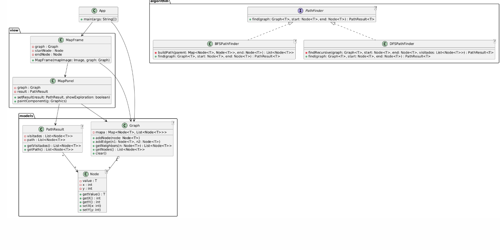

# IMPLEMENTACIÓN DE ALGORITMOS BFS Y DFS PARA ENCONTRAR RUTAS EN UN MAPA

## 1. CARÁTULA

UNIVERSIDAD: [Universidad Politecnica Salesiana]  
CARRERA: Computación  
ASIGNATURA: Estructura de Datos – Segundo Interciclo  
DOCENTE: Ing. Pablo Torres  

TÍTULO DEL PROYECTO:  
Implementación de un Algoritmo para Encontrar la Ruta Óptima en un Laberinto Aplicando Programación Dinámica y Estructuras de Datos  

INTEGRANTES:  
- Juan Miguel Naula A. – jnaulaa4@est.ups.edu.ec  

FECHA: [09/02/2026]

---

## 2. ÍNDICE

1. Objetivo  
2. Descripción del problema  
3. Marco teórico  
4. Propuesta de solución  
5. Arquitectura del sistema  
6. Estructura de carpetas  
7. Funcionamiento del sistema  
8. Modos de visualización  
9. Registro de tiempos de ejecución  
10. Ejemplo de algoritmo implementado  
11. Capturas de la interfaz  
12. Conclusiones  
13. Recomendaciones  

---

## 3. OBJETIVO

Desarrollar una aplicación que permita modelar un mapa de calles como un grafo, mediante la definición de nodos que representan intersecciones, e implementar los algoritmos de búsqueda BFS y DFS para encontrar y visualizar una ruta entre un nodo de inicio y uno de destino, aplicando estructuras de datos y una correcta organización del código.

---

## 4. DESCRIPCIÓN DEL PROBLEMA

El problema consiste en encontrar una ruta entre dos puntos dentro de un mapa de calles. Dicho mapa se representa mediante un grafo, donde los nodos corresponden a intersecciones y las aristas representan las calles que las conectan.  
El sistema debe permitir comparar el comportamiento de los algoritmos BFS y DFS tanto en la exploración como en la ruta final obtenida.

---

## 5. MARCO TEÓRICO

### Grafos
Un grafo es una estructura de datos compuesta por nodos (vértices) y aristas, utilizada para representar relaciones entre elementos. En este proyecto, los grafos permiten modelar mapas de calles de manera estructurada.

### BFS (Breadth-First Search)
El algoritmo BFS recorre el grafo por niveles utilizando una cola. Garantiza encontrar la ruta más corta en grafos no ponderados.

### DFS (Depth-First Search)
El algoritmo DFS explora el grafo en profundidad utilizando recursividad o una pila. No garantiza encontrar la ruta más corta, pero permite recorrer caminos extensos rápidamente.

---

## 6. PROPUESTA DE SOLUCIÓN

La solución propuesta consiste en:
- Representar el mapa como un grafo.
- Permitir la selección de nodos de inicio y destino.
- Implementar los algoritmos BFS y DFS.
- Visualizar la exploración y la ruta final.
- Registrar los tiempos de ejecución de cada algoritmo.

---

## 7. ARQUITECTURA DEL SISTEMA (MVC)

El sistema sigue el patrón Modelo–Vista–Controlador (MVC):

- Modelo: contiene las clases Graph, Node y PathResult, encargadas de representar el grafo y los resultados de los algoritmos.
- Vista: conformada por MapFrame y MapPanel, responsables de la interfaz gráfica y la visualización del mapa.
- Controlador: la clase MapFrame gestiona la interacción del usuario, la ejecución de los algoritmos y la comunicación entre el modelo y la vista.

Esta arquitectura mejora la organización, mantenibilidad y escalabilidad del sistema.

---

## 8. DIAGRAMA UML

El diagrama UML representa las relaciones entre las clases del sistema, incluyendo la interfaz PathFinder y sus implementaciones BFSPathFinder y DFSPathFinder, así como la interacción entre el modelo y la vista.

---

## 9. ESTRUCTURA DE CARPETAS

algorithm  
- PathFinder  
- BFSPathFinder  
- DFSPathFinder  

models  
- Graph  
- Node  
- PathResult  

view  
- MapFrame  
- MapPanel  

persistence  
- GraphLoader  
- GraphSaver  

util  
- TimeLogger  

---

## 10. FUNCIONAMIENTO DEL SISTEMA

1. Se carga la imagen del mapa.
2. Se cargan los nodos y conexiones.
3. El usuario selecciona un nodo de inicio y uno de destino.
4. Se ejecuta el algoritmo BFS o DFS.
5. Se visualiza la exploración o la ruta final.
6. El tiempo de ejecución se guarda en un archivo CSV.

---

## 11. MODOS DE VISUALIZACIÓN

Modo Exploración:
- Se muestran todos los nodos visitados por el algoritmo.
- Permite observar el recorrido completo.

Modo Ruta Final:
- Solo se muestra la ruta encontrada.
- Facilita la comparación entre BFS y DFS.

---

## 12. REGISTRO DE TIEMPOS DE EJECUCIÓN

El sistema mide el tiempo de ejecución de los algoritmos BFS y DFS utilizando System.nanoTime() y guarda los resultados en un archivo CSV para su posterior análisis.

---

## 13. EJEMPLO DE ALGORITMO IMPLEMENTADO

Se implementó el algoritmo BFS utilizando una cola para recorrer el grafo por niveles, garantizando la obtención de la ruta más corta en grafos no ponderados.

---

## 14. CAPTURAS DE LA INTERFAZ

- Ejecución de BFS en modo exploración.
- Ejecución de DFS en modo ruta final.

---

## 15. CONCLUSIONES

El uso de grafos y algoritmos de búsqueda permite resolver de manera eficiente el problema de encontrar rutas en un mapa. BFS garantiza rutas más cortas, mientras que DFS ofrece un recorrido más profundo del grafo.

---

## 16. RECOMENDACIONES

- Mejorar la interfaz gráfica.
- Implementar grafos ponderados.
- Agregar algoritmos como Dijkstra o A*.

